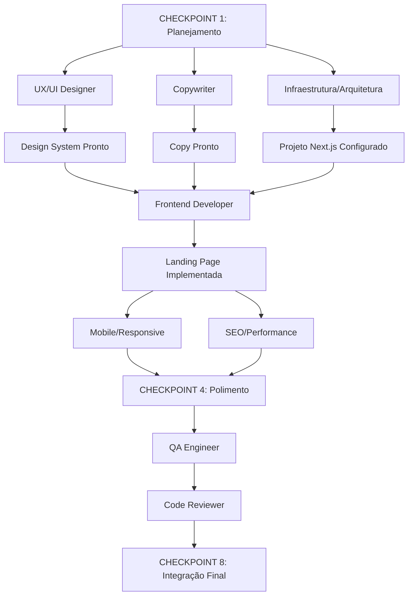

# PROJECT PLAN — Landing Page Premium para Profissionais

## 1. STACK TECNOLÓGICO

| Camada | Tecnologia | Versão | Justificativa |
|--------|------------|--------|---------------|
| Framework | Next.js | 14+ (App Router) | SSR/SSG, performance, SEO nativo |
| Linguagem | TypeScript | 5+ | Type safety, manutenibilidade |
| Estilização | Tailwind CSS | 3.4+ | Utility-first, design system consistente |
| Animações | Framer Motion | 11+ | Animações declarativas, performáticas |
| Lint/Format | ESLint + Prettier | Latest | Qualidade de código padronizada |
| Testes Unit | Jest + RTL | Latest | Testes de componentes isolados |
| Testes E2E | Playwright | Latest | Testes cross-browser, mobile |
| CI/CD | GitHub Actions | - | Automação de build, test, deploy |
| Deploy | Vercel | - | Otimizado para Next.js |

## 2. ESTRUTURA DO PROJETO

```
landing-page-studio/
├── .github/workflows/          # CI/CD
├── public/                     # Assets estáticos
├── src/
│   ├── app/                    # App Router pages
│   │   ├── layout.tsx          # Root layout + providers
│   │   ├── page.tsx            # Landing page principal
│   │   ├── globals.css         # Estilos globais + Tailwind
│   │   └── favicon.ico
│   ├── components/             # Componentes reutilizáveis
│   │   ├── ui/                 # Design system (Button, Card, etc.)
│   │   ├── sections/           # Seções da landing page
│   │   ├── layout/             # Header, Footer, WhatsApp
│   │   └── common/             # Componentes compartilhados
│   ├── lib/                    # Utilitários, configs, hooks
│   │   ├── constants.ts        # Configurações centralizadas
│   │   ├── utils.ts            # Helpers
│   │   └── hooks/              # Custom hooks
│   ├── styles/                 # Estilos adicionais se necessário
│   └── types/                  # TypeScript types
├── tests/                      # Testes E2E (Playwright)
├── .eslintrc.json
├── .prettierrc
├── tailwind.config.ts
├── tsconfig.json
├── next.config.js
├── jest.config.ts
├── playwright.config.ts
└── package.json
```

## 3. AGENTES E RESPONSABILIDADES

| Agente | Worktree | Branch | Escopo Principal |
|--------|----------|--------|------------------|
| **ORCHESTRATOR** | `worktree/orchestrator` | `main` | Planejamento, coordenação, integração, checkpoints |
| **UX/UI DESIGNER** | `worktree/design` | `feature/design-system` | Design system, tokens, componentes visuais, mockups |
| **COPYWRITER** | `worktree/copy` | `feature/copy` | Todos os textos, CTAs, FAQ, microcopy |
| **FRONTEND DEVELOPER** | `worktree/frontend` | `feature/landing-page` | Implementação das seções, componentes, interações |
| **MOBILE/RESPONSIVE** | `worktree/mobile` | `feature/responsive` | Breakpoints, mobile menu, touch targets, overflow |
| **SEO/PERFORMANCE** | `worktree/performance` | `feature/seo-performance` | SEO, metadata, Lighthouse, otimizações, a11y |
| **QA ENGINEER** | `worktree/qa` | `qa/testing` | Testes manuais/automatizados, classificação de bugs |
| **CODE REVIEWER** | `worktree/review` | `review/code-quality` | Code review, arquitetura, segurança, manutenibilidade |

## 4. WORKTREES A CRIAR

```bash
git worktree add ../worktree/orchestrator main
git worktree add ../worktree/design feature/design-system
git worktree add ../worktree/copy feature/copy
git worktree add ../worktree/frontend feature/landing-page
git worktree add ../worktree/mobile feature/responsive
git worktree add ../worktree/performance feature/seo-performance
git worktree add ../worktree/qa qa/testing
git worktree add ../worktree/review review/code-quality
```

## 5. BRANCHES E FLUXO

```
main (protegida - apenas merges aprovados)
├── feature/design-system → UX/UI Designer
├── feature/copy → Copywriter
├── feature/landing-page → Frontend Developer
├── feature/responsive → Mobile/Responsive
├── feature/seo-performance → SEO/Performance
├── qa/testing → QA Engineer
└── review/code-quality → Code Reviewer
```

**Política de Merge:**
1. Cada agente trabalha em sua branch/worktree
2. PR para `main` apenas após aprovação do Code Reviewer + QA
3. Orquestrador faz merge final após todos checkpoints

## 6. DEPENDÊNCIAS ENTRE AGENTES



## 7. CHECKPOINTS E CRITÉRIOS DE ACEITE

### CHECKPOINT 1 — PLANEJAMENTO ✅ (Este momento)
- [x] Stack definida
- [x] Arquitetura definida
- [x] Worktrees planejadas
- [x] Branches definidas
- [x] Agentes definidos
- [x] Dependências mapeadas
- [x] Critérios de aceite documentados

### CHECKPOINT 2 — DESIGN
- [ ] Design tokens (cores, tipografia, espaçamento, shadows, radius)
- [ ] Componentes base (Button, Card, Input, Badge, Container)
- [ ] Layout das seções (wireframes de alta fidelidade)
- [ ] Mockups dos dispositivos (desktop, mobile, tablet)
- [ ] Especificação de animações/microinterações
- [ ] Guia de implementação para Frontend

### CHECKPOINT 3 — IMPLEMENTAÇÃO
- [ ] Header fixo com menu responsivo
- [ ] Hero com mockup visual
- [ ] Seção Problema (3 cards)
- [ ] Seção Solução (4 cards)
- [ ] Seção Para Quem É (grid de profissionais)
- [ ] Seção Demonstrações (tabs com mockups)
- [ ] Seção O Que o Cliente Recebe
- [ ] Seção Processo (timeline)
- [ ] Seção Diferencial (comparação)
- [ ] Seção Mockup Principal (case de portfólio)
- [ ] CTA Final
- [ ] FAQ (accordion acessível)
- [ ] WhatsApp flutuante
- [ ] Footer
- [ ] Navegação suave entre seções

### CHECKPOINT 4 — POLIMENTO
- [ ] Animações de entrada (fade, slide-up)
- [ ] Hover states em todos elementos interativos
- [ ] Microinterações (botões, cards, inputs)
- [ ] Parallax discreto no hero
- [ ] Transições de página suaves
- [ ] Respeito a `prefers-reduced-motion`
- [ ] Espaçamento consistente (design tokens)
- [ ] Tipografia responsiva (clamp)

### CHECKPOINT 5 — PERFORMANCE
- [ ] Lighthouse Performance ≥ 90
- [ ] Lighthouse Accessibility ≥ 95
- [ ] Lighthouse Best Practices ≥ 90
- [ ] Lighthouse SEO ≥ 95
- [ ] Imagens otimizadas (WebP, AVIF, lazy loading)
- [ ] JavaScript mínimo (tree-shaking, code splitting)
- [ ] CSS otimizado (purge unused)
- [ ] Fontes otimizadas (preload, font-display)

### CHECKPOINT 6 — QA
- [ ] Zero bugs CRÍTICOS
- [ ] Zero bugs ALTOS
- [ ] Testes cross-browser (Chrome, Firefox, Safari, Edge)
- [ ] Testes mobile reais (iOS Safari, Android Chrome)
- [ ] Testes de acessibilidade (teclado, screen reader)
- [ ] Validação de formulários
- [ ] Validação WhatsApp link
- [ ] Validação anchors/scroll

### CHECKPOINT 7 — CODE REVIEW
- [ ] Arquitetura limpa e escalável
- [ ] Zero código duplicado (DRY)
- [ ] TypeScript strict mode sem `any`
- [ ] Componentes reutilizáveis bem tipados
- [ ] Performance patterns aplicados
- [ ] Acessibilidade nativa (sem ARIA desnecessário)
- [ ] Segurança (XSS, CSP headers)
- [ ] Documentação de componentes complexos

### CHECKPOINT 8 — INTEGRAÇÃO FINAL
- [ ] Merge limpo para `main`
- [ ] Build de produção bem-sucedido
- [ ] Testes de regressão passam
- [ ] Deploy de preview validado
- [ ] Relatório final gerado

## 8. CRITÉRIOS DE ACEITE FINAL (do briefing)

Ver seção 34 do briefing original — 27 itens obrigatórios.

## 9. VARIÁVEIS DE CONFIGURAÇÃO

```env
# .env.local
NEXT_PUBLIC_WHATSAPP_NUMBER=5511999999999
NEXT_PUBLIC_WHATSAPP_MESSAGE=Olá! Vi a demonstração de Landing Pages e gostaria de saber mais sobre um projeto para meu negócio.
NEXT_PUBLIC_SITE_URL=https://studio.demo
NEXT_PUBLIC_GA_ID=  # Opcional
```

## 10. PRÓXIMOS PASSOS IMEDIATOS

1. ✅ Criar PROJECT_PLAN.md
2. 🔄 Criar worktrees e branches
3. 🔄 Configurar projeto Next.js + Tailwind + TypeScript
4. 🔄 Criar agentes (spawn_teammate) com prompts específicos
5. 🔄 Delegar tarefas iniciais (Design System + Copy + Infra)
6. 🔄 Acompanhar CHECKPOINT 2

---

**Status:** CHECKPOINT 1 EM ANDAMENTO
**Próxima ação:** Criar worktrees e inicializar projeto base